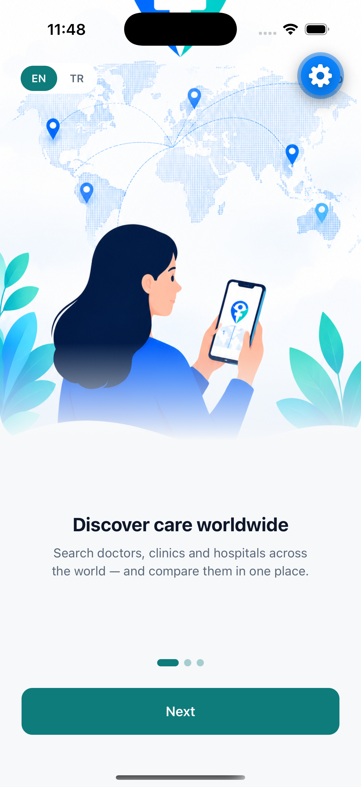
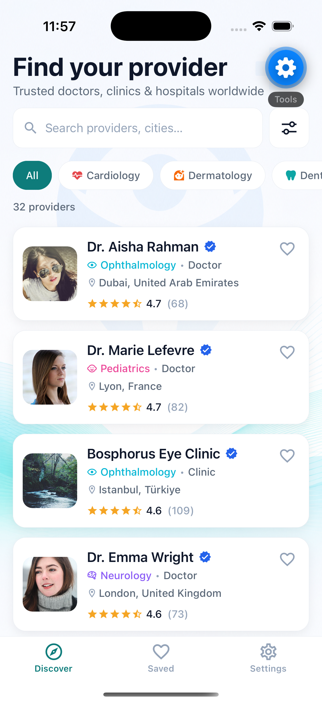
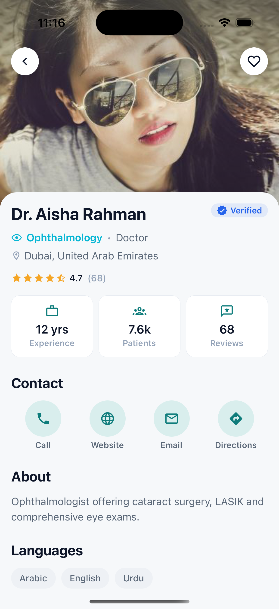
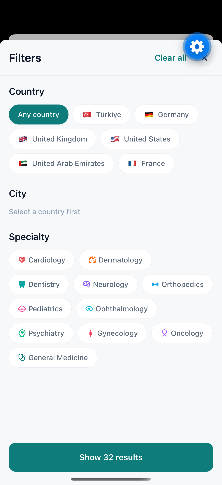

# Medora — Healthcare Provider Discovery

A production-minded slice of a global healthcare discovery app, built for a
mobile engineering case study. It implements the full flow —
**Provider List → Filter → Provider Detail** — with the polish of a real
product: animated onboarding, light/dark theming, English/Turkish localization,
smooth transitions, and proper loading / empty / error / offline states.

All data is mock, but every request runs through a **simulated network layer**
(latency + injectable failures), so the loading, retry and offline states
exercise real code paths instead of being decorative.

## Demo

<table>
  <tr>
    <td align="center"><b>Onboarding</b><br/></td>
    <td align="center"><b>Discover (List)</b><br/></td>
  </tr>
  <tr>
    <td align="center"><b>Detail</b><br/></td>
    <td align="center"><b>Filter</b><br/></td>
  </tr>
</table>

A short screen recording is in [`media/demo.mp4`](media/demo.mp4).
## Installation & Run

### Prerequisites

* Node.js
* npm
* Expo Go (for physical device testing)
* Xcode and iOS Simulator (for iOS development)
* Android Studio Emulator (optional)

### Clone the Repository

```bash
git clone <repository-url>
cd medora-healthcare-provider-discovery
```

### Install Dependencies

```bash
npm install
```

### Start the Development Server

```bash
npx expo start
```

### Run on iOS Simulator

```bash
npm run ios
```

### Run on Android Emulator

```bash
npm run android
```

### Run on a Physical Device

1. Install Expo Go on your iOS or Android device.
2. Start the development server:

```bash
npx expo start
```

3. Scan the QR code displayed in the terminal or Expo Dev Tools.

### Run Tests

```bash
npm test
```

### Type Checking

```bash
npx tsc --noEmit
```

### Notes

* The project is built with **Expo SDK 56** and uses **Expo Router**.
* No custom native code is required.
* No `pod install` step is necessary because the application runs in Expo Go.
* All provider data is mocked and served through a simulated network layer with configurable latency and failure injection for testing loading, retry, and offline states.

## Tech stack

| Concern | Choice | Why |
| --- | --- | --- |
| Framework | **Expo SDK 56 + Expo Router** | File-based routing; runs in Expo Go, no custom native code. |
| Language | **TypeScript (strict)** | Catch messy-data edge cases at compile time. |
| Async state | **TanStack Query** | Caching, loading/error flags, retries, refetch-on-reconnect. |
| UI state | **Zustand** | Filters, bookmarks, theme, language — lightweight and testable. |
| Persistence | **AsyncStorage** | Onboarding flag, theme, language, saved providers, recent searches. |
| Animation | **Reanimated 4** | Collapsing header, parallax detail hero, paginated onboarding. |
| Images | **expo-image** (+ BlurHash) | Cached images with smooth blur-up placeholders. |
| i18n | **i18next** | English + Turkish, switchable at runtime. |
| Connectivity | **NetInfo** | Offline banner + React Query online manager. |

## Requirements coverage

**The three screens**
- **List** — required search field; cards show name, specialty, city and rating, plus verified badge and save toggle. Specialty quick-filters, collapsing header, pull-to-refresh.
- **Filter** — Country, cascading City, and multi-select Specialty, with a live "Show N results" count committed on confirm.
- **Detail** — basic profile, contact info and bio, plus a parallax hero, an animated rating-distribution chart, stats, and contact actions.

**Also handled** — feature-first organization, reusable primitives, Expo Router navigation, the state split below, central null-safe formatting (missing photo/rating/city/contact all degrade gracefully), loading/empty/error states, dark mode, two languages, haptics and accessibility.

## Architecture

- **TanStack Query owns async state** — components consume `useProviders` / `useProvider`; the filter object is part of the query key, so every combination is cached independently.
- **Zustand owns UI state** (filters, bookmarks, theme, language); **AsyncStorage** persists it, hydrated once on boot to avoid a theme/language flash.
- **Simulated network** (`src/lib/mockClient.ts`) makes loading/error/offline real; `filterProviders` is a pure, unit-tested function reused for the live filter count.
- **Instant navigation** — the default list is prefetched at boot and held with `staleTime: Infinity`, filter/search use `keepPreviousData`, and detail seeds from cache; pull-to-refresh and reconnect still hit the network (where retry/offline are exercised).
- **Theming** — token-driven, intent-based colors that adapt to light/dark.

## Project structure

```
app/                   # Expo Router routes (onboarding, tabs, provider/[id], filter)
src/
  features/providers/  # api, hooks, components, types, saved store
  features/filter/      # filter store
  components/           # shared UI primitives
  theme/                # tokens, colors, ThemeProvider
  lib/                  # mockClient, storage, format, haptics, linking, hooks
  data/                 # mock providers + taxonomy
  i18n/                 # en.json, tr.json
__tests__/             # Jest + RNTL
```

## Bonus

- **Tests** — `npm test` runs 30 Jest / RNTL tests (filtering incl. case/diacritics, formatters, the Zustand stores, taxonomy cascade, and a component render).
- **Offline / retry** — an offline banner (NetInfo) plus React Query retries and refetch-on-reconnect. Set `mockConfig.failureRate = 1` in `src/lib/mockClient.ts` to force the full error + retry UI.
- **Screen recording** — [`media/demo.mp4`](media/demo.mp4).

## Getting started

```bash
npm install
npm run ios      # open in Expo Go on an iOS simulator (no pod install needed)
npm test         # Jest + RNTL
npx tsc --noEmit # strict type-check
```
